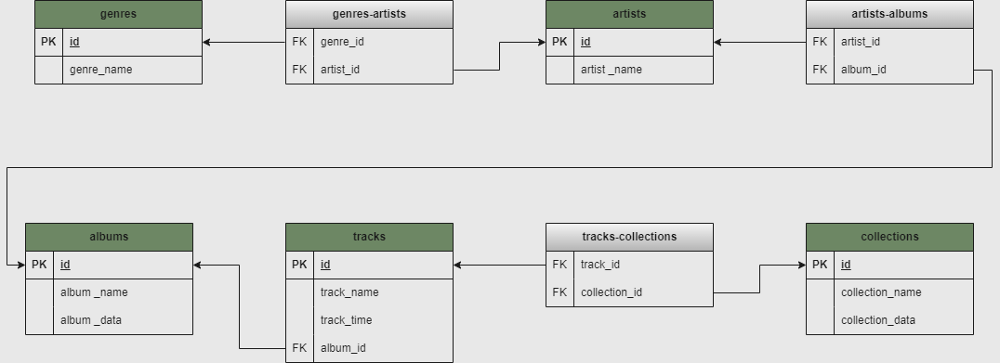

# Домашнее задание к лекции «Продвинутая выборка данных»

Схема представлена на рисунке 

## Задание 1

Продолжаем работать со своей базой данных. В этом задании заполните базу данных из домашнего задания к занятию 
"Работа с SQL. Создание БД". В ней должно быть:

* не менее 4 исполнителей,
* не менее 3 жанров,
* не менее 3 альбомов,
* не менее 6 треков,
* не менее 4 сборников.
Внимание: должны быть заполнены все поля каждой таблицы, в том числе таблицы связей исполнителей с жанрами,
исполнителей с альбомами, сборников с треками.

## Задание 2

Написать SELECT-запросы, которые выведут информацию согласно инструкциям ниже.

Внимание: результаты запросов не должны быть пустыми, учтите это при заполнении таблиц.

* Название и продолжительность самого длительного трека.
* Название треков, продолжительность которых не менее 3,5 минут.
* Названия сборников, вышедших в период с 2018 по 2020 год включительно.
* Исполнители, чьё имя состоит из одного слова.
* Название треков, которые содержат слово «мой» или «my».

## Задание 3

Написать SELECT-запросы, которые выведут информацию согласно инструкциям ниже.

Внимание: результаты запросов не должны быть пустыми, при необходимости добавьте данные в таблицы.

* Количество исполнителей в каждом жанре.
* Количество треков, вошедших в альбомы 2019–2020 годов.
* Средняя продолжительность треков по каждому альбому.
* Все исполнители, которые не выпустили альбомы в 2020 году.
* Названия сборников, в которых присутствует конкретный исполнитель (выберите его сами).

## Задание 4

Написать SELECT-запросы, которые выведут информацию согласно инструкциям ниже.

Внимание: результаты запросов не должны быть пустыми, при необходимости добавьте данные в таблицы.

* Названия альбомов, в которых присутствуют исполнители более чем одного жанра.
* Наименования треков, которые не входят в сборники.
* Исполнитель или исполнители, написавшие самый короткий по продолжительности трек, — теоретически таких треков может быть несколько.
* Названия альбомов, содержащих наименьшее количество треков.

## Результатом работы будет три файла в формате .sql:

* с INSERT-запросами (задание 1) [Home_work_database_3_1.sql](Home_work_database_3_1.sql)),
* с SELECT-запросами (задание 2,3,4) [Home_work_database_3_2.sql](Home_work_database_3_2.sql)),
* с CREATE-запросами (из предыдущей домашней работы) [Home_work_database_2.sql](Home_work_database_2.sql)).